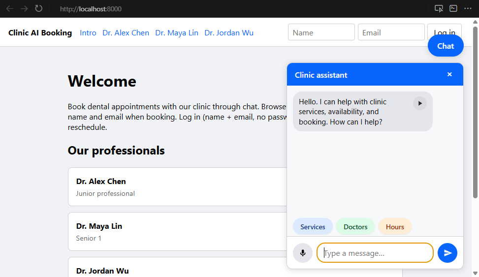
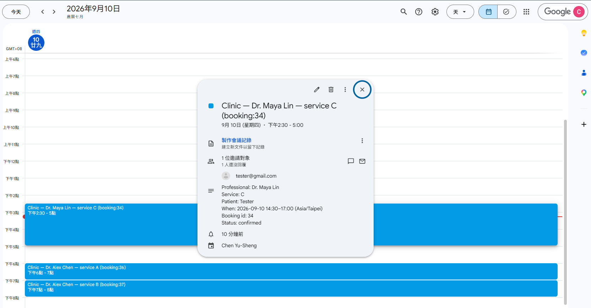

# External — clinic product guide

For dental clinic owners and front-desk staff. Technical install (clone, `.env`, Docker): [internal.md](internal.md#quick-start).

## What you get

A **website assistant** so patients can:

- See your dentists and when they are **busy** (other patients’ names stay private)
- **Book** by chat — and optionally **speak** into the messenger
- Receive a **calendar invite and email** from the **clinic’s** Google and/or Outlook account when a booking is confirmed

Language: **English only**. Clinic clock: **Asia/Taipei**.

## Your team and services

| Who | What they can book |
|-----|--------------------|
| Junior dentist | Services **A** and **B** (1 hour each) |
| Senior dentist 1 | Services **A–E** |
| Senior dentist 2 | Services **A–E** |

| Service | Length |
|---------|--------|
| A, B | 1 hour |
| C | 2.5 hours |
| D | 2 hours |
| E | 6 hours |

The assistant only offers **real free starts** that fit those lengths. It stays on clinic topics (booking and related questions); it does not invent open slots.

## How patients use it

1. Open the clinic website.
2. Optionally browse a dentist’s page to see busy times.
3. Open **Chat**, ask to book (service, dentist, day), pick a time the bot lists, and confirm.
4. Optional **Log in** with name + email (no password in this demo) if your IT later enables cancel/reschedule that way.

After a confirmed book, the dentist’s page shows a busy block. With calendars connected, the patient also gets mail / a calendar invite from the clinic.

Long service **E** may need a dentist’s OK first (`pending`). The patient can get a “waiting for approval” email; a confirmed calendar event waits until that approve step exists.

## What you (or IT) set up outside this website

These steps are **not** done inside the chat app:

1. **Clinic Google account** (Calendar + send mail) and/or **Microsoft 365 / Outlook** mailbox for the clinic — with admin approval where Microsoft requires it.
2. Hand the credentials to whoever runs the server so bookings can write to those calendars. Step-by-step for IT: [docs/oauth-setup.md](docs/oauth-setup.md).
3. Decide whether the demo runs **without** live calendars first (bookings still show on the website) or **with** Google and/or Outlook connected.

Patients do **not** sign in with their own Google or Microsoft accounts. The **clinic** calendar creates the invite and lists the patient as a guest.

Server install and day-to-day ops: [internal.md](internal.md).

## What this is not

- Not a full practice system (no billing, charts, or X-rays)
- Not password-protected login yet (name + email only — fine for a closed demo, not for the open internet)
- Not a staff screen to approve overtime / service E yet
- Declining a calendar invite does **not** by itself cancel the booking on the clinic website

## If something goes wrong

Contact the person who installed and runs this stack for your clinic. They can check the server and calendar setup ([internal.md](internal.md), [docs/oauth-setup.md](docs/oauth-setup.md)).

## Later improvements

Things we may add next (cancel/reschedule in chat, easier Outlook setup, stronger login, and more): [TODOS.md](TODOS.md).
