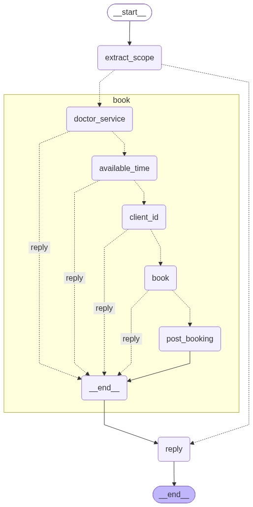
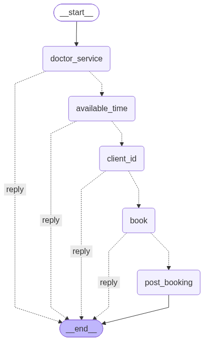

# Internal

Dental clinic booking assistant (English, `Asia/Taipei`). MVP **0.1.0**. Open work: [TODOS.md](TODOS.md).

## Quick start

```bash
git clone https://github.com/YSChen0609/clinic-ai-booking.git
cd clinic-ai-booking
cp .env.example .env

# CPU (default)
docker compose up --build -d

# Or NVIDIA GPU for faster Ollama — see docs/host-requirements.md
docker compose -f compose.yml -f compose.gpu.yml up --build -d

docker compose exec ollama ollama pull qwen2.5:7b
curl -s http://localhost:8000/health
```

| | |
|--|--|
| Site | http://localhost:8000 |
| Voice | http://localhost:8790/health |

SSH: `git clone git@github.com:YSChen0609/clinic-ai-booking.git`

## Architecture

| Piece | Role |
|-------|------|
| Postgres + `domain/booking.py` | Source of truth: hours, duration, junior/senior, free slots |
| `chat/` (extract → book graph → reply) | LLM extracts fields; engine books; replies are deterministic |
| `llm.py` / `voice/` | Provider swap points (Ollama + Voicebox today) |
| `notify/` (`CalendarPort` / `EmailPort`) | Google + Outlook adapters; fake by default |
| FastAPI + Compose | Web UI, session cookie, app/db/ollama/voice stack |

Flow: patient chat → extract/sanitize draft → engine list/check/book → optional calendar/email upsert.

**Postgres + the booking engine** own clinic rules. The LLM must not invent free starts or booking success. Swap LLM / voice / calendar vendors at the edges without rewriting rules.

### LangGraph

Outer turn graph: extract/scope → optional book subgraph → reply. Export from LangGraph: `get_graph(xray=True).draw_mermaid_png()`.



Booking subgraph (`build_book_graph().compile()`):



Regenerate PNGs into `docs/images/` with the same `draw_mermaid_png()` exporter.

## Choices

| Choice | Why | Trade-off |
|--------|-----|-----------|
| Engine before LLM | Rules and free starts must be deterministic | Chat UX follows engine statuses |
| Extract + sanitize, not free-form ReAct Agents with tools | Closed A–E / catalog doctors; tests assert draft/facts | Extra Python merge logic; edge typos still flake |
| LangGraph book loop | Enough for multi-turn book | Cancel/reschedule not in chat yet |
| Name + email cookie login | Fast local demo | No password — not public-internet safe |
| Clinic-owned calendars via ports | Expand vendors without rewriting booking | Real Outlook tenant setup is ops-heavy; Google is known-good |
| Cascaded voice (STT→text→TTS) | Reuses chat path | No barge-in |
| Compose | Reproducible local/prod-like stack | Rebuild app image after baked static/Python changes |

## Security

- Signed session cookie (`SESSION_SECRET`); cancel/reschedule API requires same user.
- Secrets via `.env` / Compose only (not in image); app runs as non-root.
- Public busy calendars omit patient names/emails.
- **Gap:** login has no password — add password/OAuth before any public deploy.

## Cost (production assumption)

| Item | Notes |
|------|--------|
| App + Postgres | Modest always-on compute; measure with host metrics |
| LLM | Dominant: local GPU/CPU for Ollama (free), or hosted API $ behind `llm.py` |
| Voice | Extra RAM/CPU for Whisper/Piper, or cloud STT/TTS $ |
| Google / Microsoft Graph | Free tiers / M365 license; API $ unknown — check vendor billing |
| Build / maintenance | Human hours for OAuth, model upgrades, booking-rule changes — track separately |

## Test / deploy

```bash
docker compose up -d db
uv sync --group dev
uv run pytest
```

Live Ollama dialogues (needs `db` + `ollama` + pulled model):

```bash
docker compose up -d db ollama
docker compose exec ollama ollama pull qwen2.5:7b
uv run pytest -m llm
```

Real calendars: [docs/oauth-setup.md](docs/oauth-setup.md). Smoke: [docs/smoke_test.md](docs/smoke_test.md).

Layout: root packaging + Compose + this file / [external.md](external.md); code in `src/`; ops notes and images in `docs/`.

## Next work

1. Reliable Outlook + dual Google/Outlook smoke
2. Chat cancel/reschedule
3. Constrained decoding for extract enums
4. Password/OAuth before public access

Details: [TODOS.md](TODOS.md).
